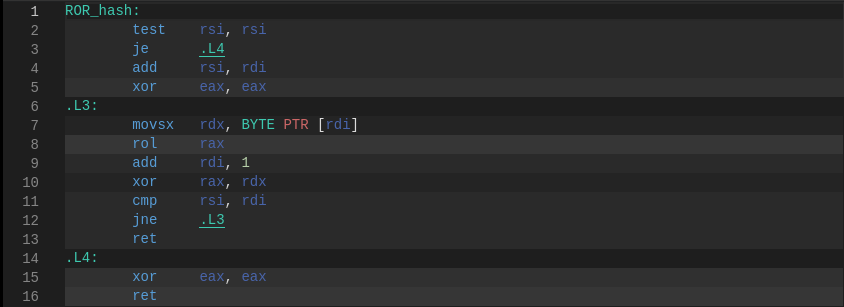

# Hash Table Research 

In my research, I'm going to use a simple hash table implementation 
with doubly linked lists that are responsible for handling collisions. 

## Research objectives

- To create a hash table implementation in C

- To test different hash functions under a high load factor scenarious and pick the best one

- Analize the hash table perfomance and optimize it using:
    - Inline assembly
    - Intrinsics
    - Separate assembly file

### High Load Factor Testing
While a load factor greater than 2 is generally considered suboptimal,
this research will intentionally test hash table performance in such scenarios.

## Part 1. Hash functions

### Naive Hashes

 


The first three hash functions implemented are:
- Zero: Always returns zero.
    - Variance: 14400
- Length: Returns the length of the word.
    - Variance: 2000
- First: Returns ASCII code of the first letter.
    - Variance: 860

As expected, those functions poorly distribute the words among lists.

### ASCII sums hashes


- Normilized: Returns the sum of ASCII codes devided by the length of the words.
    - Variance: 1460
- ASCII: Returns the sum of ASCII codes
    - Variance: 26

The ASCII hash function proved to be relatively effective, despite the simplicity of the algorithm

### Rotate hashes 


- ROL: Rolling On Left hash 
    - Variance: 4.72
- ROR: Rolling On Right hash
    - Variance: 12.5

```C
uint64 rol(uint64 num):
    return ((num << 1) | (num >> 63))

uint64 ROL_hash(char* mem, int len):
    uint64 hash = 0
    for i in len:
        hash = rol(hash)
        hash = hash ^ mem[i]    
    return hash
```

Also the compiler efficiently optimizes the ROL hash function
by replacing the rol() function with a single assembly instruction:



### Advance hashes


- KR: K&R Hash function
    - Variance: 3.758
- Jenkins: Jenkins Hash function
    - Variance: 3.822
- Elf: PJW Hash function used in Unix ELF format:
    - Variance: 3.561
- Murmur: Murmur hash function
    - Variance: 4.361
- CRC: Cyclic Cedundancy Check algorithm
    - Variance: 3.799

Those well-known hash functions provide the least collisions.

# Part 2. Optimizations

In order to identify performance bottlenecks, I'm going to use the `perf` performance analyzing tool.

### System info

- CPU: AMD Ryzen 5 5600H

- Compiler: Debian clang 16.0.6 (with -O3 flag)

## Original Performance

I will be benchmarking the performance using the **lookup test**.
It inserts every single word from the "Romeo and Juliet" book.
Then, it looks up every word 10000 times.

The original time is 7.9 * 10^10 ticks.

## Optimizing strcmp

>Note: Using strcmp() is a bad idea in the first place, it's used for educational purposes.
The correct approach in this situation will be discussed later

The performance analysis with `perf` shows that the `strcmp()` function takes up 70%
of the program's execution time.
Unfortunately, I stand no chance against the authors of the C standard library. 
So in order to optimize the `strcmp()` I'll use additional information about 
the words' lengths.


*Fun fact*: the longest word in the book is *serving-creature*. Luckily I didn't
include the dashes into the hash table, so the actual longest word is *servingcreature* - exactly
16 letters. What a coincidence!

So the idea is simple. Let's allocate a 16-byte space for each word.
That way, the algorithm complexity for comparing two words is O(1).
To be more exact, it requires a single AVX2 comparison.

```C
...
_mm128 str_sse = 0
memcpy(str_sse, str, strlen(str))

for elem in list:
    if (elem.str == ref_str):
        return elem.value
return -1
```
The new time is 4.78 * 10^10 ticks, which is a 64.5% improvement.
This is a classic __space–time tradeoff__, as it requires up to 8 times more memory.
Also, it only works for at max 16-byte words.


## Using hashes 
Since even after optimizing `strcmp` it still ruins the performance,
so we should try to use it as little as we can. The idea is very simple.
If collision occurres, it only means that the string hashes have the same remainders after the division by the size.
And in the most cases the *full 64-bit* hashes will be different

The execution time with this optimization is 3.93 * 10^10 ticks, which is a 22% improvement.

### Further optimizations

The next step of optimizing list look up is keeping the list sorted.
That allows us to reduce the complexity of the search from `O(n)` to `O(logN)`.
But this optimization is out of scope of this research, so I won't implement it.

## Optimizing hash table size

Even though I intentionally created the hash table small in the first place,
I think it's finally the time to increase the number of buckets. 


I'm going to set the number of buckets to 100000 (around 40MiB) to avoid list lookup latency at all.

The new time is 1.9 * 10^10 ticks.

## Optimizing hash function

Now, hash function is taking up 26% of the execution time. So let's optimize it.

There's the original CRC32 hash:

```C
uint64_t HashCRC32(const char* mem, size_t size):
    uint32_t cur_hash = key
    for i in size:
        cur_hash = _mm_crc32_u8(cur_hash, mem[i])

    return cur_hash;
```

As we can see, this code doesn't utilise the facts that `0 < size <= 16`.
Keeping this in mind, let's unroll the loop:

```C
uint64_t HashCRC32_unroll(const void* mem, size_t size):
    uint32_t cur_hash = key
    switch (size):
        case 16: cur_hash = _mm_crc32_u8(cur_hash, mem[15])
        case 15: cur_hash = _mm_crc32_u8(cur_hash, mem[14])
        ... ...
        case  2: cur_hash = _mm_crc32_u8(cur_hash, mem[1])
        case  1: cur_hash = _mm_crc32_u8(cur_hash, mem[0])

    return cur_hash;
```

- HashCRC32        - 17.5 * 10^10 ticks 
- HashCRC32_unroll - 18.3 * 10^10 ticks 

Unfortunally, this optimization didn't work. Let's try to rewrite it in assembly and 
have a closer look:
```mk
HashCRC32_unrool_asm:
        mov     eax, key
        dec     rdi
        jmp     [.table + rdi*8]
.table:
        dq  .left_1
        ... ...
        dq  .left_16
.left_16:
        crc32   eax, byte [rdi+15]
... ... ... ... ... ... ... ...
.left_2:
        crc32   eax, byte [rdi+1]
.left_1:
        crc32   eax, byte [rdi]
        ret

```

- HashCRC32_unroll_asm - 17.2 * 10^10 ticks

This assembly function perfoms a little better. This was achieved by removing 
unnecessary boundary checks. But crc32 instruction has 
16-32-64-bit versions, so by utilizing them we can get better results:

> This also makes this code **unsafe**

Here are two versions I wrote.

The first one is very similar to loop unrolling, but it also utilizes 
different `crc32` instructions
```mk
...
.left_12:
        crc32   eax, dword [rdi+8]
        crc32   rax, qword [rdi]
        ret
.left_11:
        crc32   eax, byte [rdi+10]
.left_10:
        crc32   eax,  word [rdi+8]
        crc32   rax, qword [rdi]
        ret
...
```

Unfortunaly, the perfomance stayed the same. My guess is that the function
just became too big, so it can no longer fit in the cache.

The second version perfomed better:
```C
uint64_t HashCRC32_inline(const void* data, size_t length) {
    uint64_t hash = 0;
    alignas(16) char str[16] = {};

    memcpy(str, data, length);

    uint64_t str_addr = (uint64_t)str;

    asm(
        "crc32 %[hash], qword ptr [%[str]]      \n\t"
        "crc32 %[hash], qword ptr [%[str] + 8]  \n\t"
        : [hash] "+r" (hash)
        : [str] "r" (str)
        : "memory"
    );
    return hash;
```
>Using inline assembly in those cases is considered a bad practice. 
This code can be easily rewritten using intrinsics, but inline assembly was
required in the original task and used in educational purpuses.

The resulting time is 15.0 * 10^10 ticks, which is a 25% hash function speed improvement.
That results in a 5% overall perfomance boost.

The final time is 1.8 * 10^10 ticks

# Results

| Optimization | Time (10^10 ticks) | Percentage Boost |
|-------------------|--------------------|--------------------|
| Original Implementation | 7.9 | - |
| Optimizing strcmp | 4.78 | 65% |
| Using Hashes for Comparison | 3.93 | 22% |
| Optimizing Hash Table Size | 1.9 | 52% |
| Optimizing Hash Function (CRC32_inline) | 1.8 | 5% |

>Note: The percentage boost for each optimization is calculated based on the improvement from the previous optimization step.
