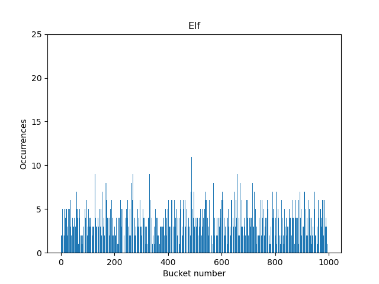

# Hash Table Research 

In my research, I'm going to use a simple hash table implementation
with doubly linked lists, which are responsible for handling collisions. 

## Research objectives

- To create a hash table implementation in C

- To test different hash functions under a high load factor scenarious and pick the best one

- To analyze the hash table perfomance and optimize it using:
    - Inline assembly
    - Intrinsics
    - Linked assembly file

> #### High Load Factor Testing
> While a load factor greater than 2 is generally considered suboptimal,
this research will intentionally test hash table performance in such scenarios.

## Part 1. Hash functions

The first object of our research will be hash functions.
I will start with simple (naive) hash functions and then progress to more advanced ones.
The test data will be taken from the book "Romeo and Juliet".
To describe the hash functions numerically, I will use variance:

$$\text{Var(X)} = \frac{1}{n}\sum_{i=1}^n(x_i - \mu)^2, $$
where $\mu$ is the average value:

$$
\mu = \frac{1}{n} \sum_{i = 1}^n x_i
$$

The ideal hash function distributes words evenly so that the variance approaches zero.

> You can check all the hash functions realizations [here](hash_functions/hash_functions.cpp)

### Naive Hashes

<p float="left">
    
    
    
</p>

The first three hash functions implemented are:
- Zero: Always returns zero.
    - Variance: 14400
- Length: Returns the length of the word.
    - Variance: 2000
- First letter: Returns ASCII code of the first letter.
    - Variance: 860

These functions poorly distribute the words among lists
because of their simplicity

<details>
  <summary><i>Function implementations</i></summary>
  
  ```c
uint64_t HashZero(const char* mem, size_t size) {
    return 0;
}

uint64_t HashLength(const char* mem, size_t size) {
    return size;
}

uint64_t HashLetter(const char* mem, size_t size) {
    return (uint64_t)mem[0];
}
  ```
</details>

### ASCII sums hashes

<p float="left">
    
    
</p>

- Normilized: Returns the sum of ASCII codes divided by the length of the words.
    - Variance: 1460
- ASCII: Returns the sum of ASCII codes
    - Variance: 26

The ASCII hash function proved to be relatively efficient, despite the simplicity of the algorithm

<details>
  <summary><i>Function implementations</i></summary>
  
  ```c
uint64_t HashSum(const char* mem, size_t size) {
    uint64_t hash = 0;
    for (size_t i = 0; i < size; i++) {
        hash += (uint64_t)mem[i];
    }

    return hash;
}

uint64_t HashNormalSum(const char* mem, size_t size) {
    return HashSum(mem, size) / size;
}
  ```
</details>

### Rotate hashes 

<p float="left">
    
    
</p>

- ROL: Rolling On Left hash 
    - Variance: 4.72
- ROR: Rolling On Right hash
    - Variance: 12.5

<details>
  <summary><i>Function implementations</i></summary>

```C
uint64 rol(uint64 num) {
    return ((num << 1) | (num >> 63))
}

uint64 ROL_hash(const char* mem, int len) {
    uint64 hash = 0
    for (int i = 0; i < len; i++) {
        hash = rol(hash)
        hash = hash ^ mem[i]
    }
    return hash
}
```

</details>

> Also the compiler efficiently optimizes the ROL hash function
by replacing the rol() function with a single assembly instruction: (line 8)
>

### Advanced hashes

<p float="left">
    
    
    
    
    
</p>

- KR: Hash function from [K&R book](https://en.wikipedia.org/wiki/The_C_Programming_Language)
    - Variance: 3.758
- Jenkins: [Jenkins Hash function](https://en.wikipedia.org/wiki/Jenkins_hash_function)
    - Variance: 3.822
- Elf: [PJW Hash function](https://en.wikipedia.org/wiki/PJW_hash_function) used in Unix ELF format:
    - Variance: 3.561
- Murmur: [Murmur hash function](https://ru.wikipedia.org/wiki/MurmurHash2)
    - Variance: 4.361
- CRC: [Cyclic Redundancy Check](https://en.wikipedia.org/wiki/Cyclic_redundancy_check) algorithm
    - Variance: 3.799

Those well-known hash functions are highly optimized and provide the least collisions.

# Part 2. Optimizations

In order to identify performance bottlenecks, I'm going to use the [perf](https://en.wikipedia.org/wiki/Perf_(Linux)) performance analyzing tool.

### System info

- **OS**: Linux kali 6.6.9-amd64

- **CPU**: AMD Ryzen 5 5600H

- **Compiler**: Debian clang 16.0.6 (with -O3 flag)

- **RAM**: 
    - Size: 16gb
    - Clock: 3200 MHz

## Original Performance

I will benchmark the performance using the **lookup test**.
Basically, it looks up every word from the "Romeo and Juliet" book 10000 times.

### Measuring time

To measure the execution time I will use the `RDTSC` CPU instruction.
It returns the elapsed time in CPU cycles (later referred to as ticks).

The original time without any optimizations is (7.86 +- 0.08) $\cdot \ 10^{10}$ ticks.

## Optimizing strcmp

>Note: Using strcmp() is a bad idea in the first place and it's used for educational purposes.
The correct approach in this situation will be discussed later

The performance analysis with `perf` shows that the `strcmp()` function takes up 70%
of the program's execution time.

Unfortunately, I stand no chance against the authors of the C standard library. 
So in order to optimize the `strcmp()` I'll use additional information about 
the word lengths.


>*Fun fact*: the longest word in the book is *serving-creature*. Luckily I didn't
include the hyphens in the hash table, so the actual longest word is *servingcreature* - exactly
16 letters. What a coincidence!


So the idea is simple. Let's allocate 16 bytes for each word.
This way, the algorithm complexity for comparing two words is O(1).
Specifically, it's a single AVX2 comparison.

Here's the algorithm in pseudocode:
```C
...
_mm128 str_sse = 0
memcpy(str_sse, str, strlen(str))

for elem in list:
    if (elem.str == ref_str):
        return elem.value
return -1
```
The new time is (4.76 +- 0.03) $\cdot \ 10^{10}$ ticks, which is a 64.5% improvement.
This is a classic __space–time tradeoff__, as it requires up to 8 times more memory.
Also, it only works for at max 16-byte words.

## Using hashes 

Because even after optimizing `strcmp` it still ruins performance,
we should try to use it as little as possible. The idea is quite simple.
When a collision occurs, in most scenarios, the complete 64-bit hashes will be different, despite having the same remainder from size division.
This allows us to save some time by first comparing the full hashes, and only using `strcmp` afterwards.

> Note that while 64-bit hash collisions are extremely rare, we still cannot afford to not check them. 

The execution time with this optimization is (3.96 +- 0.04) $\cdot \ 10^{10}$ ticks, which is a 22% improvement.

### Further optimizations

The next step of optimizing list look up is keeping the list sorted.
That allows us to reduce the complexity of the search from `O(n)` to `O(logN)`.
But this optimization is out of scope of this research, so I won't implement it.

## Optimizing hash table size

Even though I intentionally made the hash table small in the first place,
and since we've probably reached the optimization limit on high load factors,
I think it's finally time to increase the number of buckets.


> The exponential function approximation is used for visualization purposes only

I'm going to set the number of buckets to 100000 (which requires about 40MiB of RAM)
to avoid list lookup latency at all.

The new time is (1.93 +- 0.02) $\cdot \ 10^{10}$ ticks.

## Optimizing hash function

Now, the hash function takes up 26% of the execution time. So let's optimize it.

There's the original CRC32 hash:

```C
uint64_t HashCRC32(const char* mem, size_t size):
    uint32_t cur_hash = key
    for i in size:
        cur_hash = _mm_crc32_u8(cur_hash, mem[i])

    return cur_hash;
```

As we can see, this code doesn't utilise the facts that `0 < size <= 16`.
Keeping this in mind, let's unroll the loop:

```C
uint64_t HashCRC32_unroll(const void* mem, size_t size):
    uint32_t cur_hash = key
    switch (size):
        case 16: cur_hash = _mm_crc32_u8(cur_hash, mem[15])
        case 15: cur_hash = _mm_crc32_u8(cur_hash, mem[14])
        ... ...
        case  2: cur_hash = _mm_crc32_u8(cur_hash, mem[1])
        case  1: cur_hash = _mm_crc32_u8(cur_hash, mem[0])

    return cur_hash;
```

- HashCRC32        - (17.5 +- 0.1) $\cdot \ 10^{10}$ ticks 
- HashCRC32_unroll - (18.3 +- 0.1) $\cdot \ 10^{10}$ ticks 

Unfortunally, this optimization didn't work. Let's try to rewrite it in assembly and 
have a closer look:
```mk
HashCRC32_unrool_asm:
        mov     eax, key
        dec     rdi
        jmp     [.table + rdi*8]
.table:
        dq  .left_1
        ... ...
        dq  .left_16
.left_16:
        crc32   eax, byte [rdi+15]
... ... ... ... ... ... ... ...
.left_2:
        crc32   eax, byte [rdi+1]
.left_1:
        crc32   eax, byte [rdi]
        ret

```

- HashCRC32_unroll_asm - (17.2 +- 0.1) $\cdot \ 10^{10}$ ticks

This assembly function perfoms a little better. This was achieved by removing 
unnecessary boundary checks. But crc32 instruction has 
16-32-64-bit versions, so by utilizing them we can get better results:

> This also makes this code **unsafe**, since any string longer than 16 characters will crash the program.

Here are two function versions I made.

The first one is very similar to loop unrolling, but it also utilizes 
different `crc32` instructions
```mk
...
.left_12:
        crc32   eax, dword [rdi+8]
        crc32   rax, qword [rdi]
        ret
.left_11:
        crc32   eax, byte [rdi+10]
.left_10:
        crc32   eax,  word [rdi+8]
        crc32   rax, qword [rdi]
        ret
...
```

Unfortunaly, the performance remained the same.
In cases when performance behaves unexpectedly,
there are usually two things that might cause it: *caching* or *branch prediction*.

We can check both using these simple `perf` commands:
```
perf stat -e cache-misses ./build/hash_table
perf stat -e branch-misses ./build/hash_table
```

The branch predictor behaved similarly for both functions, but the cache misses 
were more frequent for a second one (which is not surprising, since the second function is twice as big).
```
 Performance counter stats for './build/hash_table_2':
           2450798      cache-misses
```
```
 Performance counter stats for './build/hash_table_1':
           2368225      cache-misses
```

Anyway, the second version perfomed much better:
```C
uint64_t HashCRC32_inline(const void* data, size_t length) {
    uint64_t hash = 0;
    alignas(16) char str[16] = {};

    memcpy(str, data, length);

    asm(
        "crc32 %[hash], qword ptr [%[str]]      \n\t"
        "crc32 %[hash], qword ptr [%[str] + 8]  \n\t"
        : [hash] "+r" (hash)
        : [str] "r" (str)
        : "memory"
    );
    return hash;
```
>Using inline assembly in these cases is considered a bad practice, since it's not really needed and
this code can easily be rewritten using intrinsics. But inline assembly was
required in the original task and was used for educational purpuses.

The resulting time is (15.0 +- 0.1) $\cdot \ 10^{10}$ ticks, which is a 25% hash function speed improvement.

This optimization required a lot of time and effort, knowledge of assembly, it made this code unportable.
And it resulted in a whopping 5% overall perfomance boost.

This optimization would only pay off in situations when you're desperate for performance.

The final total time is (1.83 +- 0.02) $\cdot \ 10^{10}$ ticks

# Results

| Optimization (with -O3 flag)              | Time ($10^{10}$ ticks)| Percentage Boost |
|-------------------------------------------|-----------------------|------------------|
| Original implementation                   | 7.86 +- 0.08          | -                |
| Optimizing `strcmp` using SIMD instuctions| 4.76 +- 0.03          | 65%              |
| Using hashes for comparison               | 3.96 +- 0.04          | 22%              |
| Optimizing hash table size                | 1.93 +- 0.02          | 52%              |
| Optimizing hash function using inline asm | 1.83 +- 0.02          | 5%               |

>Note: The percentage boost for each optimization is calculated based on the improvement from the previous optimization step.
